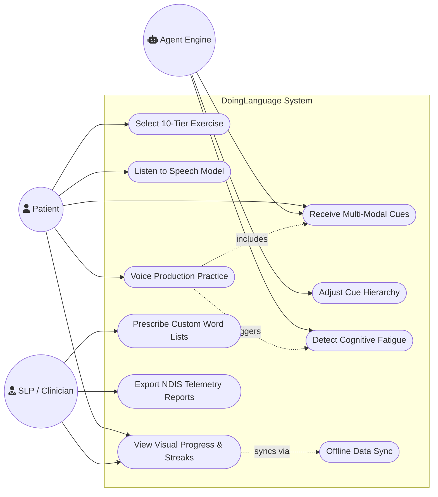
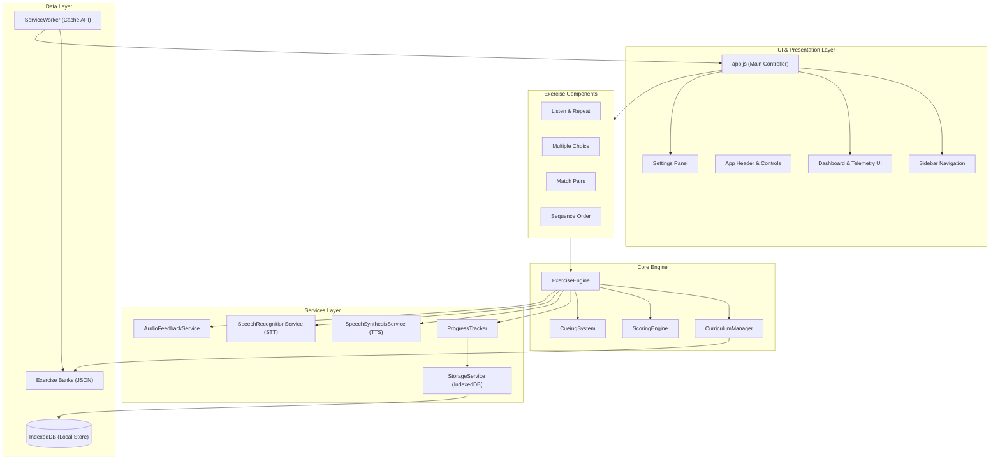
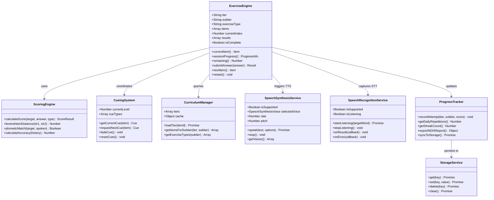
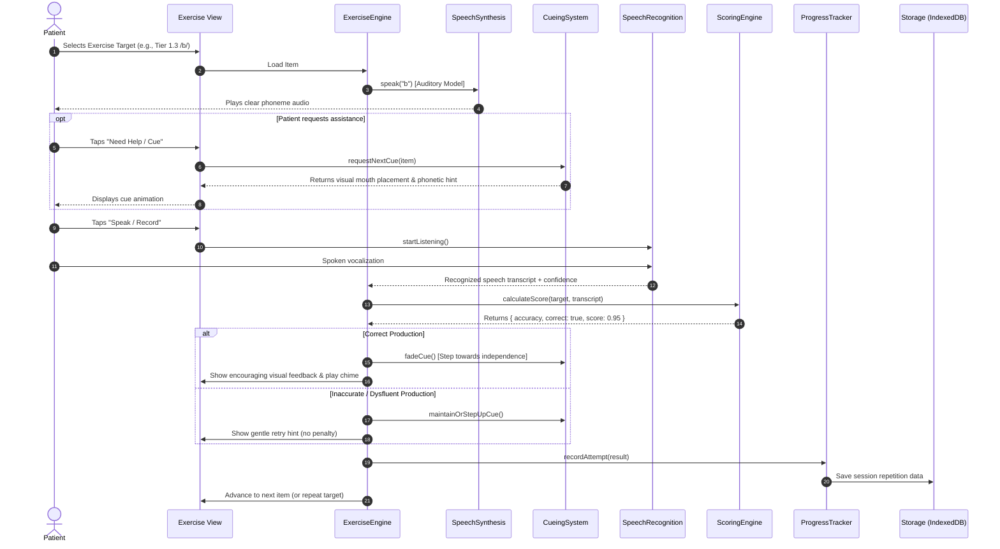
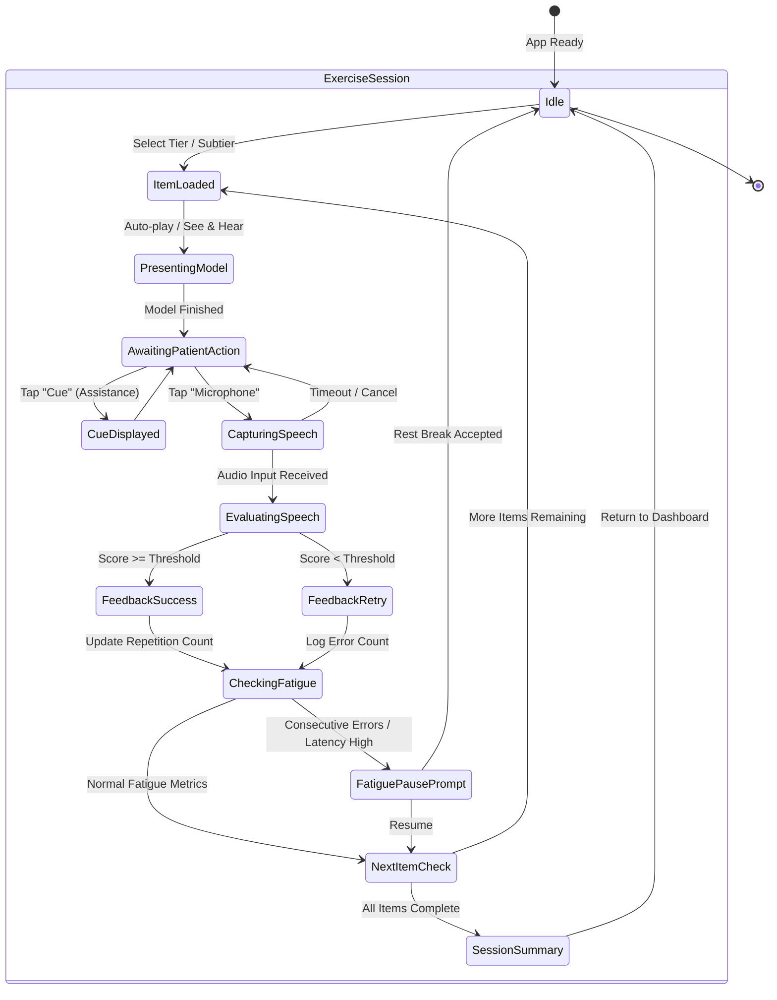

# DoingLanguage — Progressive Speech & Language Training Tool

Listed directory js
Listed directory engine
Listed directory services
Listed directory exercises
Viewed exercise-engine.js:1-60

Here is the complete set of **UML Diagrams** for **DoingLanguage**, modeled directly on your codebase architecture and clinical PML (Principles of Motor Learning) flow.

You can copy and paste these into GitHub Markdown, Devpost, or any Mermaid-compatible viewer.

---

### 1. UML Use Case Diagram
*Defines the roles of the Patient, Speech-Language Pathologist (SLP), and System Agent.*

---

### 2. UML Component Architecture Diagram
*Shows the modular structure and data flow between UI, Core Engines, Services, and Storage.*

---

### 3. UML Class Diagram
*Illustrates the classes, methods, properties, and relationships in the codebase.*

---

### 4. UML Sequence Diagram: Exercise Execution & Speech Feedback Loop
*Traces the message flow when a patient performs a speech production exercise.*

---

### 5. UML State Machine: Exercise Lifecycle & Fatigue Management
*Shows state transitions during a user practice session.*

