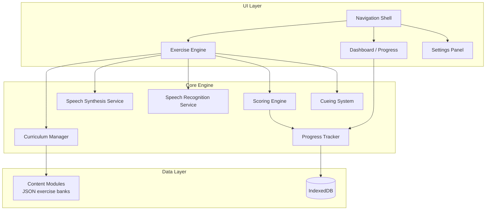

# DoingLanguage — Progressive Speech & Language Training Tool

A web-based training application designed to help people with **Apraxia** (motor speech planning difficulty) and **Aphasia** (language comprehension/production disorder) rebuild language skills through structured, progressive exercises with integrated speech synthesis and recognition.

## Design Philosophy

> [!IMPORTANT]
> This tool is designed as a **supplementary home-practice aid**, not a replacement for professional speech-language pathology (SLP) therapy. The exercise hierarchy follows evidence-based **Principles of Motor Learning (PML)** used in clinical rehabilitation.

**Core Principles:**
- **Progressive difficulty** — each tier builds on the last, from individual sounds → paragraphs → concepts
- **Multi-modal input** — visual, auditory (TTS), and speech (recognition) channels working together
- **High repetition** — motor learning requires 50+ repetitions per target; exercises encourage this
- **Cueing hierarchy** — full model → partial cue → independent production, with cues that fade as the user improves
- **Patience-first UX** — no timers, no pressure, no penalties; large touch targets; clear visual feedback
- **Offline-capable** — works as a Progressive Web App (PWA) for use anywhere

---

## Technology Stack

| Layer | Choice | Rationale |
|-------|--------|-----------|
| **Framework** | Vanilla HTML/CSS/JS + Web Components | Zero dependencies, fast load, accessible by default |
| **Speech Output** | Web Speech API `SpeechSynthesis` | Universal browser support; lets user hear correct pronunciation |
| **Speech Input** | Web Speech API `SpeechRecognition` | Chrome/Edge focused; progressive enhancement with graceful fallback |
| **Data Storage** | IndexedDB (via idb-keyval wrapper) | Stores progress, scores, custom word lists, settings locally |
| **Offline** | Service Worker + Cache API | PWA for offline practice sessions |
| **Styling** | CSS Custom Properties + Container Queries | Responsive, dark mode support, accessibility-first |
| **Build** | None (ES modules, no bundler needed) | Simplicity; can add Vite later if needed |

---

## Application Architecture



---

## Curriculum — 10 Tiers of Progressive Training

### Tier 1: Foundations — Letters, Numbers & Punctuation

> **Goal:** Recognise, name, and produce individual symbols — the atoms of written language.

#### 1.1 Alphabet — Uppercase (A–Z)
- **See & Hear:** Letter displayed large; TTS speaks its name and phoneme
- **Match:** Tap the letter you hear from a grid of 4–6 choices
- **Name it:** User speaks the letter name; speech recognition checks
- **Sequence:** Arrange scrambled letters in alphabetical order (drag-and-drop)

#### 1.2 Alphabet — Lowercase (a–z)
- Same exercise types as 1.1 with lowercase forms
- **Case matching:** Pair uppercase with lowercase (A→a)

#### 1.3 Letter–Sound Correspondence (Phonemes)
- **Phoneme isolation:** "What sound does B make?" → /b/
- **Initial sound identification:** "Which letter starts 'ball'?" with picture cue
- **Audio discrimination:** Hear two sounds, decide same or different
- 44 English phonemes covered across consonants, short vowels, long vowels, diphthongs, r-controlled vowels

#### 1.4 Numbers (0–100)
- **Number recognition:** See the digit, hear TTS speak it
- **Number naming:** User speaks the number shown
- **Number-word matching:** Pair "7" with "seven"
- **Counting sequences:** Fill in the missing number
- **Place value awareness:** Tens and ones (for two-digit numbers)

#### 1.5 Punctuation & Special Characters
- **Symbol recognition:** Period, comma, question mark, exclamation mark, apostrophe, quotation marks, colon, semicolon, hyphen, parentheses
- **Function awareness:** "What does a question mark do?" — multiple choice
- **Sentence punctuation:** Add the correct punctuation to a spoken sentence

---

### Tier 2: Syllable Formation

> **Goal:** Build the bridge between individual sounds and whole words through syllable-level motor planning.

#### 2.1 CV Syllables (Consonant–Vowel)
- Simple open syllables: ba, da, go, me, no, ti, so, la, etc.
- **Listen & Repeat:** TTS speaks; user repeats; speech recognition compares
- **Build it:** Drag a consonant card onto a vowel card to form the syllable; hear the result

#### 2.2 VC Syllables (Vowel–Consonant)
- Closed starting syllables: at, in, up, on, am, etc.
- Same exercise patterns as 2.1

#### 2.3 CVC Syllables (Consonant–Vowel–Consonant)
- Closed syllables: bat, dog, cup, sit, pen, etc.
- **Blend it:** Three-card drag to form CVC; hear each phoneme then the blended syllable
- **Minimal pairs:** bat/pat, cap/cab — discrimination and production

#### 2.4 Blends & Clusters (CCVC, CVCC)
- Initial blends: stop, frog, trip, plan, snap, etc.
- Final blends: milk, help, hand, nest, etc.
- **Blend building:** Progressively add consonants to a base syllable

#### 2.5 Multi-syllable Patterns
- Two-syllable: apple, tiger, open, basket
- Three-syllable: banana, elephant, umbrella
- **Syllable clapping:** Tap/click for each syllable heard — builds prosodic awareness
- **Syllable assembly:** Drag syllable tiles to build the word (e.g., el + e + phant)

#### 2.6 Rhyming
- **Rhyme match:** "Which word rhymes with 'cat'?" — bat, dog, hat (multi-select)
- **Rhyme generation:** Given a word, user produces rhyming words (speech recognition)
- **Odd one out:** Three words, find the non-rhyming one

---

### Tier 3: Word Formation

> **Goal:** Move from syllables to meaningful words, building functional vocabulary.

#### 3.1 High-Frequency Words
- Dolch sight words / Fry words adapted for adults (functional daily vocabulary)
- Categories: greetings, food, body parts, household, emotions, time words, safety words
- **Flashcard mode:** See word → hear TTS → attempt production → self-rate or speech-recognition check
- **Picture–word matching:** See an image, choose or speak the word
- **Fill-in:** Sentence with blank, choose the correct word

#### 3.2 Word Families / Patterns
- Grouped by rime: -at family (bat, cat, hat, mat, sat, rat), -an, -it, -op, -ug, etc.
- **Pattern discovery:** "What's the same in all these words?"
- **Generate:** Given the pattern, produce new words in the family

#### 3.3 Morphology — Prefixes & Suffixes
- Common prefixes: un-, re-, pre-, dis-, mis-, over-, under-
- Common suffixes: -ing, -ed, -er, -est, -ful, -less, -ness, -tion
- **Build-a-word:** Base word + affix → new word (e.g., help + ful → helpful)
- **Meaning shift:** "Happy → Unhappy. What changed?"
- **Root word identification:** "What is the root word in 'unhelpful'?"

#### 3.4 Functional / Emergency Vocabulary
- Critical phrases: "Help", "Call 911", "I need…", "My name is…", "I have a medical condition"
- Practised with extra repetition and multi-modal cues
- Can be pinned as quick-access phrases

---

### Tier 3.5: Compound Words

> **Goal:** Understand how two known words combine to create new meaning.

- **Compound recognition:** "Sunflower = sun + flower" — split and identify parts
- **Compound building:** Given two word lists, drag to form valid compounds
- **Picture clue:** See image of a "rainbow" → type or speak the compound word
- **Meaning inference:** "If 'book' + 'shelf' = 'bookshelf', what does it mean?"
- Word bank: 100+ common compounds (butterfly, football, sunrise, bedroom, notebook, toothbrush, etc.)

---

### Tier 3.6: Synonyms & Opposites

> **Goal:** Expand word retrieval networks — critical for aphasia recovery.

#### 3.6.1 Antonyms (Opposites)
- **Match pairs:** hot↔cold, big↔small, up↔down, happy↔sad
- **Complete the pair:** "The opposite of 'light' is ___"
- **Graduated difficulty:** concrete pairs → abstract pairs (freedom↔captivity)

#### 3.6.2 Synonyms
- **Match synonyms:** happy=glad, large=big, quick=fast
- **Choose the synonym:** "Which word means the same as 'angry'?" — furious, calm, tired
- **Synonym chains:** happy → glad → joyful → elated → ecstatic (graduated intensity)

#### 3.6.3 Categorisation / Semantic Fields
- **Odd one out:** "Apple, banana, chair, grape" — which doesn't belong?
- **Category naming:** "These are all ___: dog, cat, bird, fish" → animals
- **Word associations:** "Tell me words related to 'kitchen'" — open-ended speech exercise

---

### Tier 3.7: Heteronyms

> **Goal:** Master words spelled the same but pronounced differently based on context.

- **In-context reading:** "The wind began to **wind** through the valley"
- **Pronunciation choice:** Hear two pronunciations; select which fits the sentence
- **Sentence pairs:** Side-by-side sentences using the same word differently
- **Stress pattern practice:** Record yourself saying both pronunciations

| Word | Meaning A | Meaning B |
|------|-----------|-----------|
| lead | /liːd/ to guide | /lɛd/ the metal |
| tear | /tɪər/ from crying | /tɛər/ to rip |
| wind | /wɪnd/ moving air | /waɪnd/ to coil |
| read | /riːd/ present tense | /rɛd/ past tense |
| close | /kloʊs/ nearby | /kloʊz/ to shut |
| bass | /bæs/ the fish | /beɪs/ low sound |
| bow | /baʊ/ to bend | /boʊ/ ribbon/weapon |
| desert | /ˈdɛzərt/ dry land | /dɪˈzɜːrt/ to abandon |
| dove | /dʌv/ a bird | /doʊv/ past of dive |
| live | /lɪv/ to exist | /laɪv/ in real-time |
| minute | /ˈmɪnɪt/ time unit | /maɪˈnjuːt/ tiny |
| object | /ˈɒbdʒɪkt/ a thing | /əbˈdʒɛkt/ to protest |
| present | /ˈprɛzənt/ a gift | /prɪˈzɛnt/ to show |
| produce | /ˈprɒdjuːs/ food | /prəˈdjuːs/ to make |
| record | /ˈrɛkərd/ a log | /rɪˈkɔːrd/ to capture |
| refuse | /ˈrɛfjuːs/ garbage | /rɪˈfjuːz/ to decline |
| row | /roʊ/ a line | /raʊ/ an argument |
| sow | /saʊ/ a pig | /soʊ/ to plant seeds |
| subject | /ˈsʌbdʒɪkt/ topic | /səbˈdʒɛkt/ to impose |
| wound | /wuːnd/ an injury | /waʊnd/ past of wind |

---

### Tier 4: Sentence Formation

> **Goal:** Combine words into grammatically correct, meaningful sentences.

#### 4.1 Subject–Verb (SV)
- "Dogs run." / "Birds sing." / "She sleeps."
- **Build it:** Drag word tiles into order
- **Speak it:** Full sentence production with TTS model first

#### 4.2 Subject–Verb–Object (SVO)
- "The cat chased the mouse." / "I drink water."
- **Sentence scramble:** Reorder jumbled words
- **Sentence completion:** "The girl ate ___"

#### 4.3 Expanding Sentences
- Add adjectives: "The **big** dog ran **quickly**"
- Add prepositions: "The book is **on the** table"
- Add time words: "**Yesterday**, I went to the store"

#### 4.4 Question Formation
- Yes/no questions: "Do you like coffee?"
- Wh- questions: Who, What, Where, When, Why, How
- **Transform:** "She is happy." → "Is she happy?"

#### 4.5 Negation
- "I do not like spinach." / "She cannot swim."
- **Transform:** Affirmative → negative

#### 4.6 Complex Sentences (Conjunctions)
- Coordinating: and, but, or, so
- Subordinating: because, although, when, if, while
- **Sentence combining:** "It rained. We stayed inside." → "We stayed inside **because** it rained."

#### 4.7 Sentence Comprehension
- **Picture matching:** Read/hear a sentence, choose the picture that matches
- **True or false:** "Cats can fly." — True/False
- **Follow instructions:** "Point to the blue circle" (interactive canvas)

---

### Tier 5: Paragraph & Discourse

> **Goal:** Produce and understand connected text — multiple sentences working together.

#### 5.1 Sentence Sequencing
- Given 3–5 scrambled sentences, arrange them into a logical paragraph
- Visual story sequences with corresponding sentences

#### 5.2 Topic Sentences & Main Ideas
- Read a short paragraph; identify the topic sentence
- Choose the best title for a paragraph
- "What is this paragraph mainly about?"

#### 5.3 Reading Comprehension
- Short passages (3–6 sentences) with comprehension questions
- Difficulty progression: literal → inferential → evaluative questions
- Option to have TTS read the passage aloud

#### 5.4 Paragraph Construction
- **Guided writing:** Given a topic sentence + 3 supporting ideas, arrange into a paragraph
- **Sentence generation:** Given a topic, produce 3–5 related sentences (typed or spoken)
- **Cloze passages:** Fill in blanks within a paragraph to maintain coherence

#### 5.5 Retelling / Narration
- Listen to a short story (TTS narrated)
- Retell in your own words (speech recognition captures attempt)
- Key-point checklist: did the retelling include characters, setting, events, conclusion?

---

### Tier 6: Concepts & Pragmatic Language

> **Goal:** Apply language to real-world reasoning, social interaction, and abstract thinking.

#### 6.1 Categories & Classification
- Sort items into categories (animals, food, transport, clothing, etc.)
- Superordinate categories: "Furniture" includes chair, table, sofa
- Feature identification: "What is round, bouncy, and used in sports?" → ball

#### 6.2 Time Concepts
- Clock reading (analogue and digital)
- Days of the week, months, seasons — sequencing and naming
- Before/after, yesterday/today/tomorrow
- Duration concepts: "How long is an hour?"

#### 6.3 Spatial Concepts
- Preposition understanding: in, on, under, beside, between, behind, in front of
- Following spatial directions with interactive visual scene
- Map/direction vocabulary: left, right, north, south

#### 6.4 Number & Quantity Concepts
- More/less, equal, greater/fewer
- Basic arithmetic vocabulary: add, subtract, total, difference
- Money concepts: coin/note recognition, making change, price reading
- Measurement vocabulary: long, short, heavy, light, litre, metre

#### 6.5 Homophones
- Words that sound the same but are spelled differently
- there/their/they're, to/too/two, your/you're, here/hear, etc.
- **Choose the correct one:** Sentence with blank → pick the right homophone

#### 6.6 Idioms & Figurative Language
- Common idioms: "It's raining cats and dogs", "Break a leg", "Piece of cake"
- **Literal vs figurative:** "Does 'break a leg' mean to injure yourself?"
- Match idiom to meaning
- Graduated: start with very common idioms, progress to less familiar ones

#### 6.7 Conversational Skills / Pragmatics
- **Greetings & closings:** Appropriate hello/goodbye for formal vs informal
- **Turn-taking cues:** "Your turn to speak" visual/audio prompts
- **Topic maintenance:** Given a topic, generate 3 related comments
- **Requesting & clarifying:** "Can you repeat that?", "What do you mean by…?"
- **Social scripts:** Ordering food, answering the phone, visiting the doctor

#### 6.8 Problem-Solving & Reasoning
- "What would you do if…?" scenarios
- Cause and effect: "The ice cream melted because ___"
- Sequencing real-world events: making a sandwich, getting ready for work

---

## Additional Linguistic Concepts (Beyond the user's list)

### Tier 7: Prosody & Intonation
- **Stress patterns:** Which syllable is stressed? (COM-pu-ter vs com-PU-ter)
- **Sentence intonation:** Statement vs question rising/falling patterns
- **Emotional prosody:** Same sentence with different emotions (happy, sad, angry, surprised)
- **Pacing practice:** Slow → normal → slightly faster speech rate control

### Tier 8: Minimal Pairs
- Words differing by one sound: bat/pat, sip/zip, cat/cut, pin/pen
- **Discrimination:** Hear two words — same or different?
- **Production:** Say one, system checks which was produced
- Critical for apraxia motor planning — isolating individual articulatory movements

### Tier 9: Word Retrieval Strategies
- **Circumlocution training:** Can't find the word? Describe it instead
- **Semantic cueing:** Category + feature → target word ("It's a fruit, it's yellow" → banana)
- **Phonemic cueing:** First sound/syllable as hint → complete the word
- **Gesture pairing:** Associate a gesture with a word to aid retrieval
- **Self-cueing chains:** Practise going from category → features → first letter → word

### Tier 10: Connected Communication
- **Script training:** Memorise and practise functional scripts (ordering coffee, calling for help)
- **Supported conversation:** System provides sentence starters; user completes
- **Picture description:** Describe a scene in 3+ sentences
- **Personal narratives:** Tell about your day, a memory, a plan — with scaffolding prompts

---

## UI/UX Design

### Layout & Navigation
```
┌─────────────────────────────────────────────────┐
│  🧠 DoingLanguage            [⚙ Settings] [📊] │
├──────────┬──────────────────────────────────────┤
│          │                                      │
│ Tier 1   │    ┌──────────────────────────┐      │
│ Tier 2   │    │                          │      │
│ Tier 3   │    │    EXERCISE AREA         │      │
│ Tier 3.5 │    │                          │      │
│ Tier 3.6 │    │    Large, clear content  │      │
│ Tier 3.7 │    │    Big touch targets     │      │
│ Tier 4   │    │    Visual + audio cues   │      │
│ Tier 5   │    │                          │      │
│ Tier 6   │    └──────────────────────────┘      │
│ Tier 7   │                                      │
│ Tier 8   │    ┌──────┐  ┌──────┐  ┌──────┐     │
│ Tier 9   │    │ 🔊   │  │ 🎤   │  │ ✅   │     │
│ Tier 10  │    │Listen │  │Speak │  │Check │     │
│          │    └──────┘  └──────┘  └──────┘     │
│          │                                      │
│          │    [← Previous]  3/10  [Next →]      │
└──────────┴──────────────────────────────────────┘
```

### Accessibility Requirements (Non-Negotiable)
- **WCAG 2.2 AA** compliance minimum
- Font size minimum 18px body, 24px+ exercise content
- Contrast ratio ≥ 4.5:1 (text), ≥ 3:1 (UI components)
- Full keyboard navigation
- Semantic HTML throughout (no div-soup)
- `prefers-reduced-motion` and `prefers-color-scheme` respected
- `rem` units for all sizing
- Screen reader compatible (all exercises usable without vision)
- No time pressure on any exercise
- Clear visual + audio feedback for correct/incorrect

### Core UX Patterns
- **Listen First:** Every exercise offers "Listen" button to hear the target via TTS
- **Try It:** User attempts (speech, typing, drag-drop, or multiple choice)
- **Feedback:** Immediate, encouraging feedback — "Great!", "Almost — try again", "Let's hear it one more time"
- **Repeat:** Easy repeat button — never penalise repetition
- **Skip:** Always available — never force completion
- **Progress:** Visual progress bar per exercise, per sub-tier, per tier

---

## Data Model

### Progress Tracking
```javascript
{
  tier: "3.6",
  subtier: "synonyms",
  exerciseId: "syn-match-012",
  attempts: 5,
  correct: 3,
  accuracy: 0.6,
  lastAttempted: "2026-08-26T06:30:00Z",
  streak: 2,           // consecutive correct
  bestStreak: 4,
  speechAttempts: 3,    // times used microphone
  timeSpentMs: 45000,
  cueLevel: "partial"   // "full" | "partial" | "independent"
}
```

### Exercise Content (JSON banks)
```javascript
{
  id: "het-lead",
  tier: "3.7",
  type: "heteronym",
  word: "lead",
  variants: [
    { pronunciation: "/liːd/", meaning: "to guide", partOfSpeech: "verb",
      sentence: "She will lead the team to victory." },
    { pronunciation: "/lɛd/", meaning: "a heavy metal", partOfSpeech: "noun",
      sentence: "The pipe was made of lead." }
  ]
}
```

### Settings
```javascript
{
  speechRate: 0.8,        // 0.5–1.5 (slower default for apraxia)
  speechVoice: "default", // user can pick preferred TTS voice
  fontSize: "large",      // "normal" | "large" | "x-large"
  theme: "system",        // "light" | "dark" | "system"  
  showPhonetics: true,    // display IPA alongside words
  enableSpeechRecognition: true,
  autoPlayAudio: false,   // don't auto-play; let user control
  practiceReminder: true
}
```

---

## File Structure

```
DoingLanguage/
├── index.html                  # App shell
├── manifest.json               # PWA manifest
├── sw.js                       # Service worker
├── css/
│   ├── variables.css           # Design tokens
│   ├── reset.css               # Modern CSS reset
│   ├── layout.css              # Shell layout
│   ├── components.css          # Buttons, cards, modals
│   └── exercises.css           # Exercise-specific styles
├── js/
│   ├── app.js                  # App initialisation + router
│   ├── services/
│   │   ├── speech-synthesis.js # TTS wrapper
│   │   ├── speech-recognition.js # STT wrapper
│   │   ├── storage.js          # IndexedDB persistence
│   │   ├── progress.js         # Progress tracking
│   │   └── audio-feedback.js   # Sound effects (correct/incorrect)
│   ├── engine/
│   │   ├── exercise-engine.js  # Core exercise runner
│   │   ├── cueing-system.js    # Cueing hierarchy logic
│   │   └── scoring.js          # Accuracy & streak calculation
│   ├── components/
│   │   ├── nav-sidebar.js      # Navigation web component
│   │   ├── exercise-card.js    # Exercise display component
│   │   ├── progress-bar.js     # Progress visualisation
│   │   ├── speech-button.js    # Listen/Speak button component
│   │   ├── drag-drop-zone.js   # Drag-and-drop tile area
│   │   ├── settings-panel.js   # Settings UI
│   │   └── dashboard.js        # Progress dashboard
│   └── exercises/
│       ├── listen-repeat.js    # Listen & repeat exercise type
│       ├── multiple-choice.js  # Choose correct answer
│       ├── match-pairs.js      # Match pairs (drag or tap)
│       ├── sequence-order.js   # Put items in order
│       ├── fill-blank.js       # Sentence completion
│       ├── build-word.js       # Drag tiles to build
│       ├── picture-match.js    # Image-word matching
│       └── free-speech.js      # Open speech production
├── data/
│   ├── tier1/
│   │   ├── letters.json
│   │   ├── phonemes.json
│   │   ├── numbers.json
│   │   └── punctuation.json
│   ├── tier2/
│   │   ├── cv-syllables.json
│   │   ├── vc-syllables.json
│   │   ├── cvc-syllables.json
│   │   ├── blends.json
│   │   ├── multisyllable.json
│   │   └── rhymes.json
│   ├── tier3/
│   │   ├── high-frequency-words.json
│   │   ├── word-families.json
│   │   ├── morphology.json
│   │   └── emergency-vocab.json
│   ├── tier3.5/
│   │   └── compound-words.json
│   ├── tier3.6/
│   │   ├── antonyms.json
│   │   ├── synonyms.json
│   │   └── categories.json
│   ├── tier3.7/
│   │   └── heteronyms.json
│   ├── tier4/
│   │   ├── sv-sentences.json
│   │   ├── svo-sentences.json
│   │   ├── expanding.json
│   │   ├── questions.json
│   │   ├── negation.json
│   │   ├── complex-sentences.json
│   │   └── comprehension.json
│   ├── tier5/
│   │   ├── sequencing.json
│   │   ├── topic-sentences.json
│   │   ├── reading-passages.json
│   │   └── cloze-passages.json
│   ├── tier6/
│   │   ├── categories.json
│   │   ├── time-concepts.json
│   │   ├── spatial-concepts.json
│   │   ├── number-concepts.json
│   │   ├── homophones.json
│   │   ├── idioms.json
│   │   ├── conversation-scripts.json
│   │   └── problem-solving.json
│   ├── tier7/
│   │   └── prosody.json
│   ├── tier8/
│   │   └── minimal-pairs.json
│   ├── tier9/
│   │   └── word-retrieval.json
│   └── tier10/
│       ├── scripts.json
│       └── picture-descriptions.json
├── assets/
│   ├── icons/                  # PWA icons
│   └── sounds/                 # Correct/incorrect audio cues
└── README.md
```

---

## Phased Build Plan

### Phase 1 — Foundation (What we build first)
**Goal:** Working app shell with Tier 1 (letters, numbers, punctuation) and core engine

1. App shell (HTML + CSS + navigation)
2. Speech synthesis service
3. Speech recognition service (with fallback)
4. Exercise engine (handles all exercise types)
5. Cueing system
6. Progress tracking + IndexedDB
7. Tier 1 content + exercises
8. Settings panel
9. PWA setup (manifest + service worker)

### Phase 2 — Syllables & Words
- Tier 2 content + exercises (syllable formation)
- Tier 3 content + exercises (word formation)
- Drag-and-drop tile component
- Picture-match component

### Phase 3 — Word Relationships
- Tier 3.5 (compound words)
- Tier 3.6 (synonyms & opposites)
- Tier 3.7 (heteronyms)
- Tier 8 (minimal pairs — closely related to syllable/word work)

### Phase 4 — Sentences & Paragraphs
- Tier 4 (sentence formation — all sub-tiers)
- Tier 5 (paragraph & discourse)

### Phase 5 — Concepts & Advanced
- Tier 6 (concepts & pragmatics)
- Tier 7 (prosody & intonation)
- Tier 9 (word retrieval strategies)
- Tier 10 (connected communication)

### Phase 6 — Polish & Extend
- Dashboard with charts/visualisation
- Practice reminders
- Export progress data
- Custom word lists (user or SLP can add)
- Print exercises for offline paper practice

---

## User Review Required

> [!IMPORTANT]
> **Scope for Phase 1:** Given the scale of this project (10 tiers, 8+ exercise types, hundreds of content items), I recommend we build **Phase 1** first — the complete working app with Tier 1 content, all core services (speech, progress, cueing), and the exercise engine. This gives us a solid foundation that every subsequent tier plugs into. Shall I proceed with Phase 1?

> [!IMPORTANT]
> **Speech Recognition Limitation:** The Web Speech API's recognition works reliably only in Chrome/Edge. For other browsers, exercises will fall back to self-assessment ("Did you say it correctly? 👍/👎"). Is this acceptable, or would you prefer we investigate a cloud-based speech API for wider support?

## Open Questions

1. **Voice preference:** Do you have a preferred TTS voice or accent (Australian English, British, American)? The app will let you change this in settings, but I want to pick a good default.

2. **Images/pictures:** Several exercise types benefit from picture cues (especially in Tiers 1, 3, 4). Would you like me to use simple emoji as placeholders initially, or generate proper illustrations?

3. **Colour scheme:** Any preference for the visual theme? I'm planning a calm, low-stimulation design (soft blues/greens) with high contrast and large text. Open to your input.

4. **Priority exercises:** Are there specific tiers or exercise types you'd like me to prioritise within Phase 1? For example, if number work (0–100) is less urgent than letter-sound work, I can defer it.

---

## Verification Plan

### Automated Tests
- Lighthouse accessibility audit (target ≥ 95)
- axe-core accessibility scan
- PWA validation via Lighthouse

### Manual Verification
- Test all exercise types with keyboard-only navigation
- Test TTS across Chrome, Safari, Firefox
- Test speech recognition in Chrome
- Test responsive layout on tablet and phone viewports
- Verify progress persists across sessions (IndexedDB)
- Verify offline functionality (service worker)
- User testing with you for comfort, pacing, and clarity
